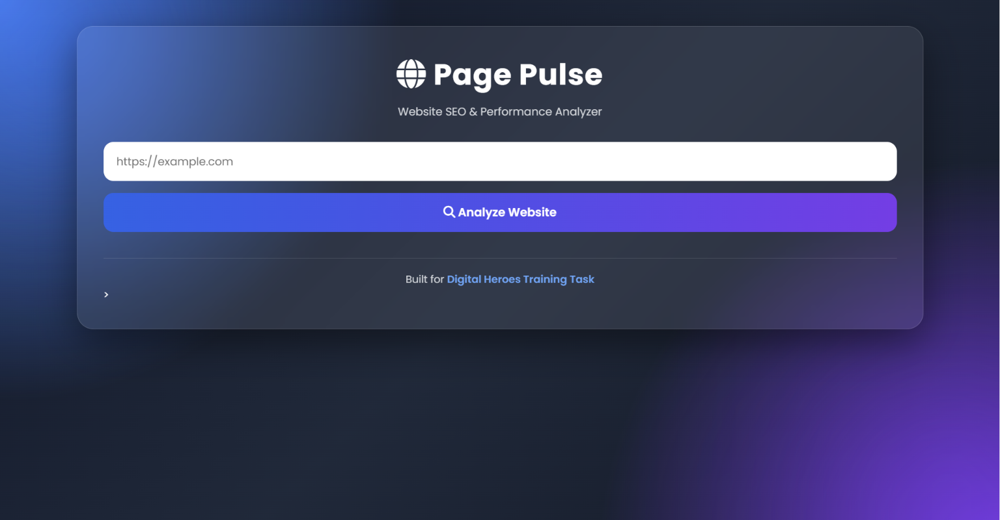
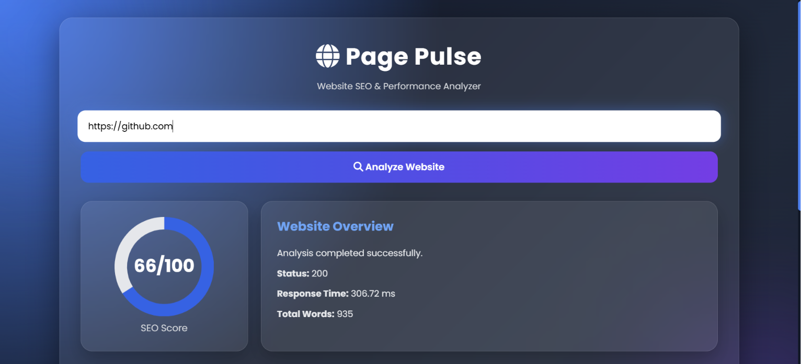

# 🚀 Page Pulse

A modern Website SEO & Performance Analyzer built using FastAPI, HTML, CSS, and JavaScript.

Page Pulse analyzes any website URL and generates an SEO report including HTTP status, response time, page title, meta description, H1 count, images missing ALT text, and approximate word count.

---

# ✨ Features

- Analyze any website URL
- HTTP Status Code
- Response Time
- Page Title
- Meta Description
- H1 Count
- Images Missing ALT Text
- Approximate Word Count
- SEO Score Dashboard
- Interactive Chart
- PDF Report Download
- Error Handling
- Responsive Design

---

# 🛠 Tech Stack

## Frontend

- HTML5
- CSS3
- JavaScript
- Chart.js
- jsPDF

## Backend

- FastAPI
- Requests
- BeautifulSoup4

## Deployment

- Vercel (Frontend)
- Render (Backend)

---

# 📂 Project Structure

```
Page-Pulse/
│
├── backend/
│   ├── main.py
│   ├── requirements.txt
│
├── frontend/
│   ├── index.html
│   ├── style.css
│   ├── script.js
│
└── README.md
```

---

# ⚙ Installation

## Clone Repository

```bash
git clone https://github.com/Anurag0163/Page-Pulse.git
```

## Backend

```bash
cd backend
pip install -r requirements.txt
uvicorn main:app --reload
```

## Frontend

Open

```
frontend/index.html
```

or deploy using Vercel.

---

# 📡 API Endpoint

```
GET /analyze
```

Example

```
/analyze?url=https://example.com
```

Sample Response

```json
{
  "status_code": 200,
  "response_time_ms": 210,
  "title": "Example Domain",
  "meta_description": "Example Description",
  "h1_count": 1,
  "images_without_alt": 0,
  "word_count": 650
}
```

---

# 💡 Design Decisions

### 1. FastAPI

FastAPI was selected because it provides high performance and automatic API documentation.

### 2. BeautifulSoup

BeautifulSoup makes HTML parsing simple and reliable for extracting SEO information.

### 3. Separate Frontend & Backend

Keeping frontend and backend separate makes deployment easier and improves maintainability.

---

# 🚀 Future Improvements

- Support JavaScript-rendered websites using Playwright
- Lighthouse Performance Integration
- SEO Suggestions
- Website Health Report
- Multi-page Website Crawling

---

# 🌐 Live Demo

Frontend

(Paste your Vercel URL here)

Backend

(Paste your Render URL here)

---


# 📷 Screenshots

## Home Page



## Analysis Result




---

# 👨‍💻 Author

**Anurag Kumar**

Built for Digital Heroes Training Task.
